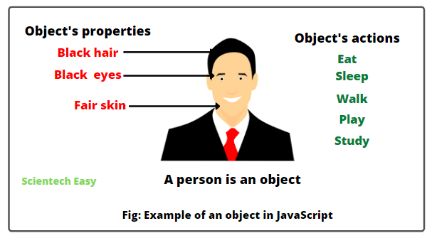

# Objects in Javascript

Objectives:
1. Define what is an object in javascript.
2. Create an object in javascript.
3. Define the importance and use of object in javascript.

`object` : In real life, objects have properties and things they can do, and it's the same with the objects in every programming language. ECMA-262 defines an object as an unordered collection of properties. It simply means that an object is an array of values in no particular order.


*Source: https://www.scientecheasy.com/wp-content/uploads/2022/03/javascript-object-example.png*

### Create a new object in javascript with object literal notation

> In creating an array we commonly use square brackets `[]`, but when creating object literal we use curly braces`{}`.

Code Example:
``` js
let user = {
    name: 'Juan',
    age: 24,
    email: 'juandelacruz143@mapagmahal.com',
    location: 'The Philippines'
}
```
#### Two ways to access and update properties of an object in javascript

**Using Dot Notation**
```js
console.log(user.name);
user.name = 'John';
console.log(user.name)
```

**Square Bracket Notation**
```js
console.log(user['name']);
user['name'] = 'John';
console.log(user['name'])
```

#### Adding a method to object and calling it with dot notation
```js
let user = {
    name: 'Juan',
    age: 24,
    email: 'juandelacruz143@mapagmahal.com',
    location: 'The Philippines',
    verify: function (){
        console.log('the user is verified');
    }
}
user.verify();
```
> Note: Always remember that a regular function is not defined inside of an object, but a method is.

#### The keyword `this`
`this`: is a javascript keyword and is a context object. It represents the context in which the current code is executed. The value of this is gonna be different depending on where and how we use it.

```js
let user = {
    name: 'Juan',
    age: 24,
    email: 'juandelacruz143@mapagmahal.com',
    location: 'The Philippines',
    verify: function (){
        console.log('the user is verified');
    }
    logName: function(){
        console.log(this.name);
    }
}
```

- In an object method, `this` refers to the `object`.
- Alone, `this` refers to the `global object`.
- In a function, `this` refers to the `global object`.
- In a `function`, in strict mode, this is `undefined`.
- In an `event`, this refers to the element that received the `event`.
- Methods like `call()`, `apply()`, and `bind()` can refer this to any object.

---
### Primitive and Reference Types
| Primitive Types | Reference Types     |
|-----------------|---------------------|
| Number          | All types of object: |
| String          | Object literals     |
| Boolean         | Arrays              |
| Row             | functions           |
| Undefined       | dates               |
| Symbol          | all other objects   |

